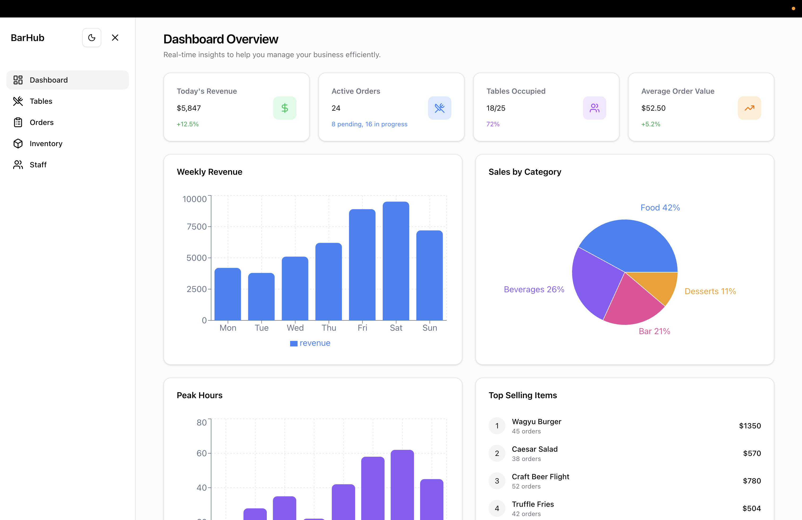
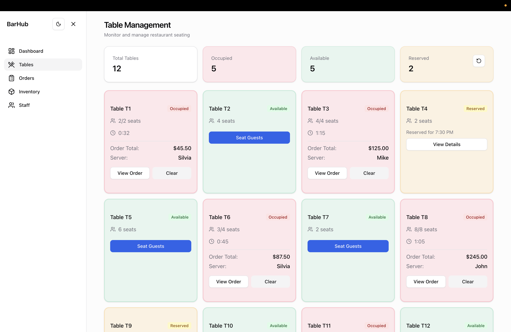
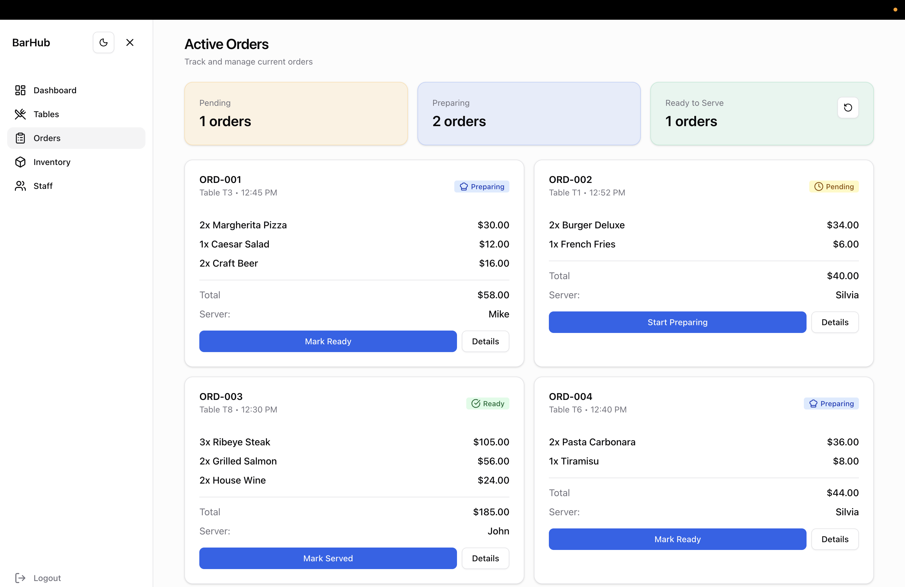
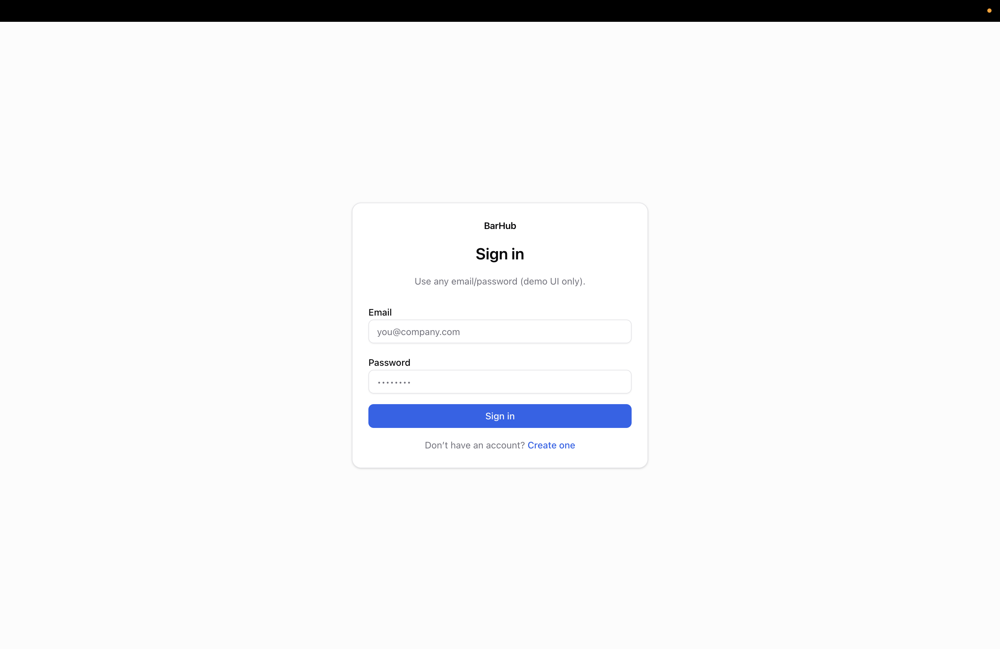

# BarHub

BarHub is a **front-end-only restaurant manager demo** built with **Next.js (App Router) + TypeScript + Tailwind v4 + shadcn/ui**. It’s designed to be portfolio-friendly: clean UI, accessible navigation, responsive layout, and “demo auth” gating for realism.

## What this demo includes
- **Dashboard**: KPI cards + charts (client-only charts to keep the rest server-rendered).
- **Tables**: seat/clear tables (local state + persistence).
- **Orders**: progress orders through statuses (local state + persistence).
- **Inventory**: stock table + progress bars + empty/alert states.
- **Staff**: grouped staff overview.
- **Demo auth**: route guard via cookie + localStorage session (no backend).

## Demo auth (important)
This project intentionally has **no backend**. “Sign in / Create account” stores a demo session locally and sets a simple cookie to gate routes.

- **Login route**: `/login`
- **Register route**: `/register` (redirects to `/login?mode=register`)
- **Protected routes**: `/dashboard`, `/tables`, `/orders`, `/inventory`, `/staff`

## Routes
- `/` → redirects to `/dashboard`
- `/login` (public)
- `/register` (public, redirect helper)
- `/dashboard` (protected)
- `/tables` (protected)
- `/orders` (protected)
- `/inventory` (protected)
- `/staff` (protected)

## Screenshots (add these for your portfolio)
Create a `public/screenshots/` folder and add:
- `public/screenshots/dashboard.png`
- `public/screenshots/tables.png`
- `public/screenshots/orders.png`
- `public/screenshots/mobile-nav.png`
- `public/screenshots/login.png`

Then embed them here:







## Getting started

```bash
pnpm install
pnpm dev
```

Open `http://localhost:3000`.

## Build & checks

```bash
pnpm lint
pnpm exec tsc --noEmit
pnpm build
pnpm start
```

## Deploy (Vercel)
1. Push this repo to GitHub.
2. Import into Vercel.
3. No env vars required.

After deploying, add the live link here:
- **Live demo**: (add your Vercel URL)

## Notes for reviewers
- Charts load client-side and show a skeleton while loading.
- Orders/Tables interactivity is **local-only** (persisted in `localStorage`), so the demo feels “alive” without a backend.
- Theme toggle persists and respects system preference.
